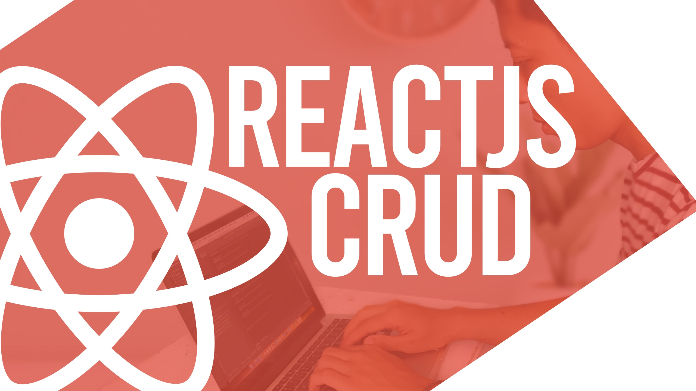

# ReactJS CRUD Tutorial - YOUTUBE
This project was created based on my youtube content about how to create ReactJS CRUD. In this project we will learn how to interact with Rest API and use Boostrap CSS framework to build the very basic UI.  In this project we will only focus on the CRUD creation part, so we will use Bootstrap to build the UI faster.

 

## Checkout the video on youtube :
<https://youtu.be/DWXfZXK4bMI>
